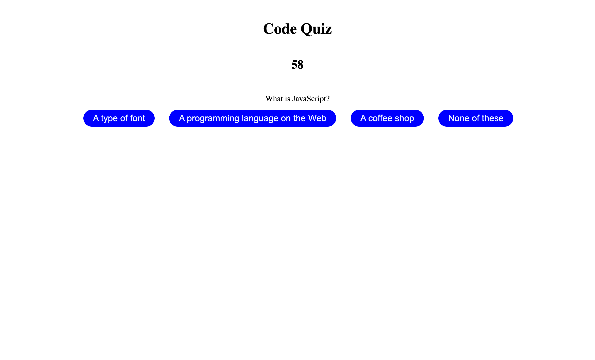

# code-quiz-repo

## A timed coding quiz application

## Description
Allows users to test their coding knowledge by taking a timed coding quiz. Provides a score for users to log their scores and track their progress. 

## Visuals
include image and link

(https://ntmartinez18.github.io/code-quiz-repo/index.html)

## Technologies
* html
* css
* javascript

## Installation
N/A

## Usage
To use this application, navigate to the web browser. Click the start button and the timer will begin and the user will be presented with a question. For every correct answer the user will add points to their score. For every wrong answer, time will be deducted from the timer. The game is over when either the user has answered all the questions or there is no time left remaining. Users may input their initials and view their score.

## Credits
Thanks to GreatStack, Giraffe Academy, and Web Dev Simplified on youtube. As well as Sara Neves Pereira and Hubert Nguyen for their help and guidance.

## License
MIT